# 我学了Java/Python/JavaScript ，但感觉什么都做不出来

---

**欢迎任何讨论！！！！**

在实习做了一些东西，同时和朋友讨论有了一点想法，想尝试梳理一下，就写了这篇。

学习编程一段时间后，会感觉到自己有一种已经理解编程语言，但是还是无法做出任何东西的感觉，我认为这种感觉是因为对编程语言不正确的认知造成的。编程语言就好像一个积木，而一个program是由无数个积木精密的堆叠而成，从而对用户的输入产生适当的回应，形成功能 feature。

这就好像你知道几个积木他们是什么，可是不知道要怎么堆叠才能形成program，因此想要做出一个东西，我们要将它不断地拆解，直到我们可以直接堆叠积木的那一步。

1. 知道自己想要做什么
2. 把想做的东西逐步拆解成自己可以做，或者知道怎样去学会做的小东西
3. 东西很小了可是还是不知道怎样给自己学会做，就去google继续拆（如何处理excel文件 变成 如何提取excel文件，如何存储被提取的数据，如何处理被存储的数据）
4. 从那个最小的东西开始一步步做完整个project


比如:

- 网络爬虫Web Crawler ： -> 访问到想要爬取的页面 -> 读取页面上的数据 -> 提取页面上的数据 -> 存储页面提取出来的数据

- 手机游戏外挂 Hack ( 比如锁血Hack )：-> 找到角色的血量存储在游戏的哪里 -> 改变游戏角色血量的数值 -> 维持游戏角色血量的数值 -> 限制反作弊系统

  

**总结就是拆拆拆拆拆拆拆然后从可以做的那一步开始做。**

基本就是这样，下面是例子。


# 例子

---

这里尝试使用Flutter (Why？因为~~很Coooool~~我没用过) 来制作一个音频播放器。最主要的功能只有三个，读取音频文件然后播放，暂停，停止。


把音频播放器拆完后大概是这样子的：

1. 制作GUI交互界面

2. 为GUI交互界面注入灵魂

   2.1. 从手机获取音频文件

   2.2. 播放音频文件

   2.3. 暂停音频文件

   2.4. 停止音频文件
   
   

然后就可以开始做了。


## 制作GUI

---

首先上网找怎样用Flutter。

- [English Tutorial Part 1](https://flutter.dev/docs/get-started/codelab)
- [English Tutorial Part 2](https://codelabs.developers.google.com/codelabs/first-flutter-app-pt2/)

- [Chinese Tutorial Part 1](https://codelabs.flutter-io.cn/codelabs/first-flutter-app-pt1-cn/#0)
- [Chinese Tutorial Part 2](https://codelabs.flutter-io.cn/codelabs/first-flutter-app-pt2-cn/index.html#0)


看完上面后，我们能知道：

1. 如何在Flutter里创造UI
2. 如何为UI增加交互性

看完之后，就可以自己制作music player的ui，这个时候里面的button还不能按。

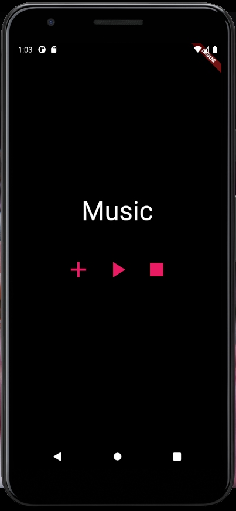


下面是**关键的code**，简明易懂，接下来我们只要补完\_play() 和 \_add() 和 \_stop() 就可以了，1搞定。**（ !!这段CODE不是完整的CODE!!，完整的CODE看[这里](https://github.com/CCease/audio_player/blob/master/lib/main.dart)）**

```dart
//这三个都是Function
_play() {
	//TODO：
}

_stop() async{
	//TODO:
}

_add() async{
	//TODO:
}

//--------Widget--------
IconButton(
    //第一个button的icon
	icon: Icon(Icons.add),
    //第一个button被按的时候执行的function ---------------- 关键！
	onPressed: () => _add(),
    //第一个button的size
	iconSize: 50.0,
    //第一个button的颜色
	color: Colors.pink,
),
IconButton(
    //第二个button的icon
	icon: Icon(Icons.play_arrow),
    //第二个button被按的时候执行的function ---------------- 关键！
	onPressed: () => _play(),
    //第二个button的icon size
	iconSize: 50.0,
    //第二个button的颜色
	color: Colors.pink,
),
IconButton(
    //和上面一样
	icon: Icon(Icons.play_arrow),
    //和上面一样------------------------------------------关键！
	onPressed: () => _stop(),
    //和上面一样
	iconSize: 50.0,
    //和上面一样
	color: Colors.pink,
),

```


## 注入灵魂

UI弄完了，onPressed也弄好了，接下来我们只要补完\_play() 和 \_add() 和 \_stop() 就可以了。

1. \_add() 从用户设备里选音频文件。
2. \_play() - 播放音频文件。（按了一次后会变pause）
3. \_stop() - 停止播放。


我们先从Add button开始做起，我们想要的效果是按了这个button后，app会给用户选择一个file，然后app能获取这个file的一些信息，让之后的play能够锁定这个file然后播放。一些信息是什么信息现在还不知道，要看让我们选file的那个东西能为我们提供什么。


**因为什么都不懂，所以我们上Google，输入Flutter get file然后search，看有什么能被我们用的。**[第一个](https://flutter.dev/docs/cookbook/persistence/reading-writing-files)好像有用，我们按进去看看。

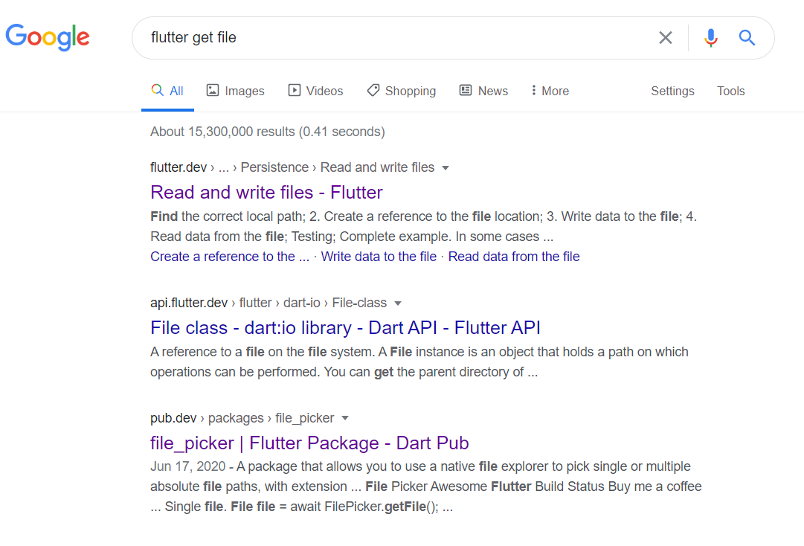

然后我们会去到这样一个界面。简单的读一下。

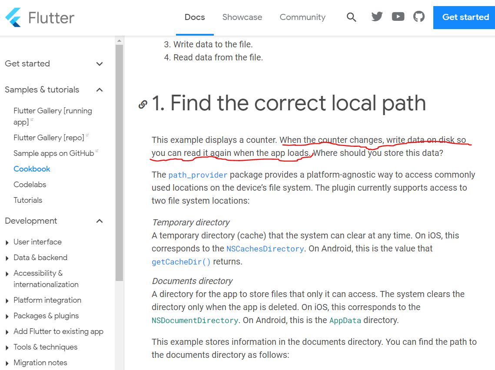

第一个按进去后，发现好像不是我们要的东西。从红线可以看出这个是拿来给app保存自己数据的，所以我们又回到google界面，然后按第三个[file_picker](https://pub.dev/packages/file_picker)。

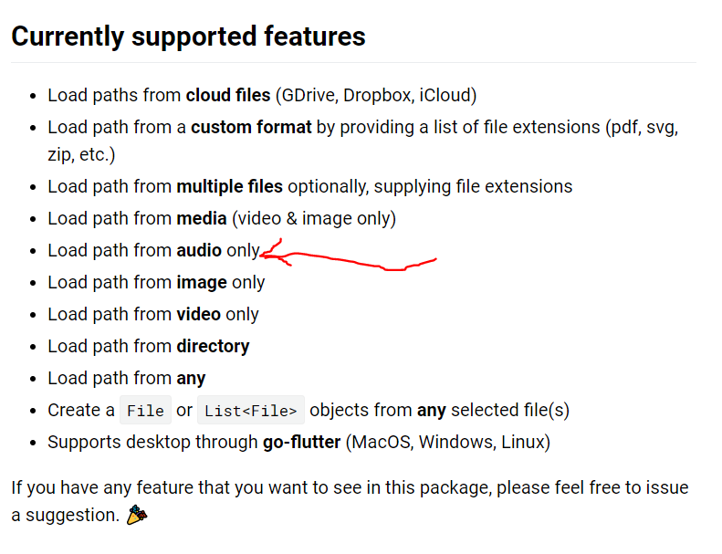

第三个file picker好像是我们要的东西，按进去看一下，往下翻，发现**好像**可以用，他有说Load path from audio only, 我们接着去看这个file picker会给我们什么资讯。

| 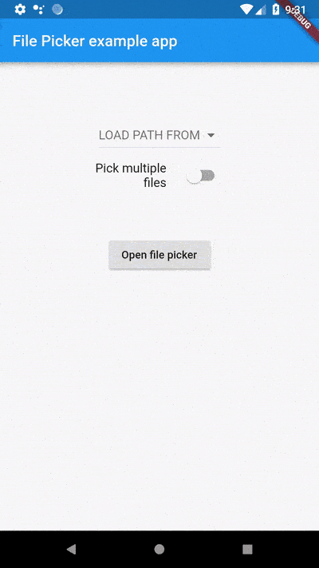 | 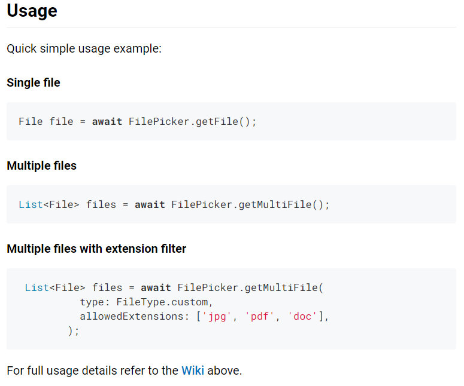 |
| --------------------------------- | ------------------------------------------------------------ |
|                                   |                                                              |


往下再翻一下，我们看到了一个example.gif和一个简单的usage介绍，感觉这就是我们要的东西，可是还需要更进一步的咨询，所以我们按那个蓝色的wiki。

| 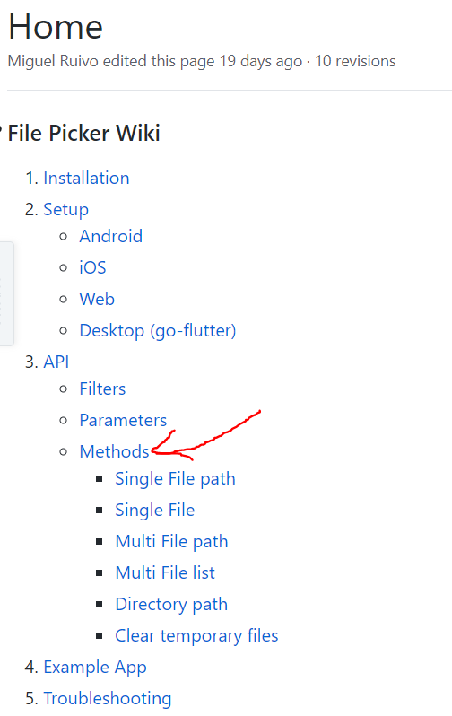| 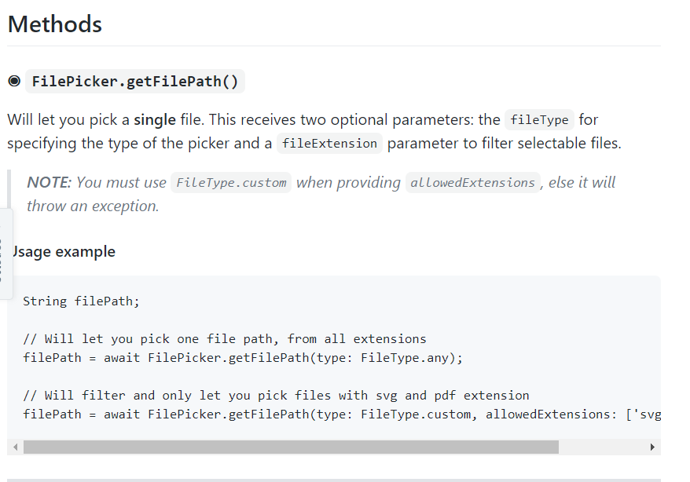 |
| ------------------------------------------------------------ | ------------------------------------------------------------ |
| 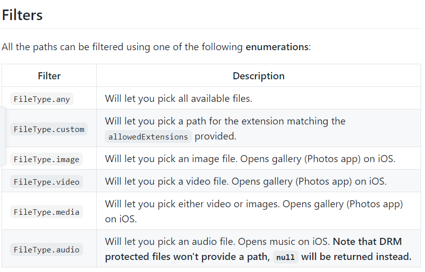 | 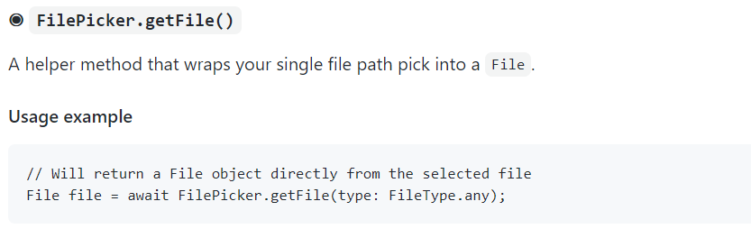 |

按了蓝色wiki后，我们按Methods，然后进去翻一下，我们会看到另外三张图的资讯，从中我们知道 ```FilePicker.getFile(type： FileType.audio)```会return一个File，而```FilePicker.getFilePath(type: FileType.audio)```会return一个String，value是filepath文件路径。知道了这个后，我们就要去看能不能通过Filepath/File来播放音频文件。可是我们也不知道怎样播放音频文件，所以我们继续google。

这里省略一堆过程，最后我们找到了[assets_audio_player](https://pub.dev/packages/assets_audio_player)，然后我们进去里面看它怎样播放音频。

| 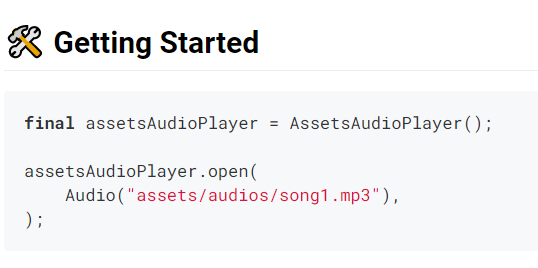 | 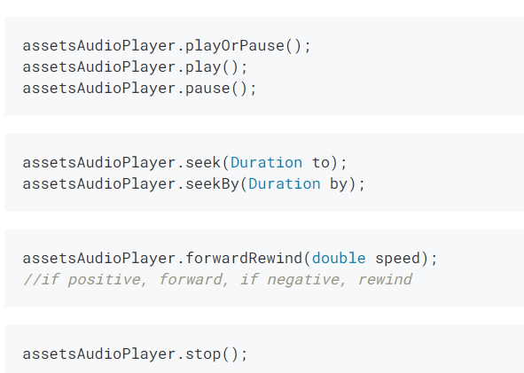 |
| ---- | ---- |
|      |      |


进去里面看看后，我们看到了这个。需要的资讯是“assets/audios/song1.mp3”，从这个format我们看得出这个就是文件路径filepath，而file_picker给我们的资讯也是文件路径filepath，代表我们可以使用这个```assetsAudioPlayer.open(Audio(filepath));``` ，让assetAudioPlayer知道我们想play哪一个音频文件，然后再用```assetsAudioPlayer.play()```让它播放音乐。同理，```assetsAudioPlayer.stop()```**应该**是拿来stop音乐的，他这里没有提供资讯，我们放进code里面自己试试就行了。

知道了这些后，我们在我们的code里面内添加这段逻辑。**（ !!这段CODE不是完整的CODE!!，完整的CODE看[这里](https://github.com/CCease/audio_player/blob/master/lib/main.dart)）**

```dart
//创建一个AssetrsAudioPlayer的object
final assetsAudioPlayer = AssetsAudioPlayer();

_play() {
    //播放音频
	assetsAudioPlayer.play();
}

_add() async{
    //创建filepath variable
    filePath = await FilePicker.getFilePath(type: FileType.audio);
    try {
      //让assetsAudioPlayer用刚刚选的filepath open 想要播放的音频
      await assetsAudioPlayer.open(
          Audio.file(filePath)
      );
    }catch(t){}
}

//--------Widget--------
IconButton(
    //第一个button的icon
	icon: Icon(Icons.add),
    //第一个button被按的时候执行的function
	onPressed: () => _add(),
    //第一个button的size
	iconSize: 50.0,
    //第一个button的颜色
	color: Colors.pink,
),
IconButton(
    //第二个button的icon
	icon: Icon(Icons.play_arrow),
    //第二个button被按的时候执行的function
	onPressed: () => _play(),
    //第二个button的icon size
	iconSize: 50.0,
    //第二个button的颜色
	color: Colors.pink,
),
IconButton(
    //和上面一样
	icon: Icon(Icons.play_arrow),
    //和上面一样
	onPressed: () {assetsAudioPlayer.stop()},
    //和上面一样
	iconSize: 50.0,
    //和上面一样
	color: Colors.pink,
),

```


然后这个app就能用了。


# 总结

---

对如何制作一个手机音频播放器的总结：

1. 先把UI做出来。

2. 知道在哪里写入交互逻辑（这里就是button的onPressed）。

3. 把逻辑写进去，不知道用什么method就google，厉害一点就自己写。

4. 出现预料之外的情况，写清楚为什么的就自己修，看不懂的就Google。

   

或者作弊一点：

  1. 上youtube找已经做好了的，比如[这个](https://www.youtube.com/watch?v=nqULc3ykR_g)。
  2. 从他给的code/video里看他是用哪一个package，直接拿来用，就省去了自己找的时间。

  3. 如果他的package旧了，或者不支持你想要的新功能，去Google找符合你需求的。

     

懒人方法：

1. 上youtube找已经做好了的，比如[这个](https://www.youtube.com/watch?v=nqULc3ykR_g)。

2. Copy and paste everything.

3. 改UI，逻辑调整一下位置。


最后结果：


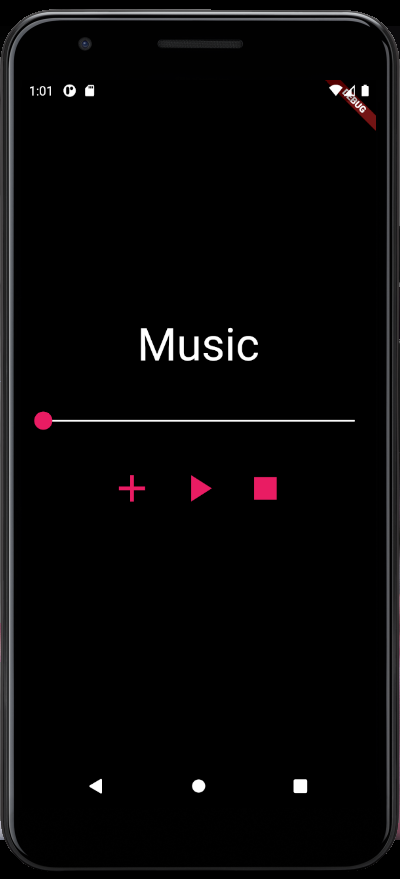


图画看不出什么，可以直接看Code，或者把apk安装到Android机上玩玩。

[Github](https://github.com/CCease/audio_player) (lib/main.dart)

[Apk](https://github.com/CCease/audio_player/blob/master/app-release.apk)

Note： 代码随便写的，质量很差。


一上来就想着要做一个手机音频播放器，可是没有对整个app进行拆解，变成可以具体执行的步骤的话，只会感到无从下手，直接疑惑。


**所以标题的 ”我学了Java/Python/JavaScript ，但感觉什么都做不出来“，应该换成 ”我学了Java/Python/JavaScript ，我想要做A，首先我要做a，然后b，然后c。我用Java/Python/JavaScript就可以做a，加一点google就可以做b和c，a+b+c=A，我把A做出来了“ 这样。**


# FAQ

---

- 所有Program都是这样做吗？

  不是，与其说这个是制作program的方法，更像是如何利用编程语言来完成一个特定的功能的方法。这个例子里没有涉及到软件的测试，工作的分工，程序员之间的协调等等等等，制作program的方法可以看[SDLC](https://www.tutorialspoint.com/sdlc/sdlc_overview.htm)，[Scrum](https://www.scrum.org/resources/what-is-scrum)。

  

- Programmer的工作内容都是这样吗？

  不知道。

  

- 做Program很容易吗？

  这个会感觉比较容易是因为File_Picker和AssetAudioPlayer已经由别人做好了，放在那里给我们用，所以会感觉比较容易。如果file_picker和AssetAudioManager没有人做（比较小几率），那么我们就需要创造这2个东西出来才能做这个Program。
  
  除此之外，这个program没有考虑到安全性，运行效率，apk大小等等。而这些non functional requirements（非功能性需求）一般来说会比纯粹的实现功能更难实现。制作一个100人能访问的网站很容易，制作一个500000000人能访问的网站，就有很大的难度了。
  
  一些资料：
  
  （中文）[服务端高并发分布式架构演进之路（以淘宝作为例子，从一百个到千万级并发情况下服务端的架构的演进过程）](https://segmentfault.com/a/1190000018626163)	
  
  （英文）[How do large Web sites handle the load of millions of visitors a day?](https://computer.howstuffworks.com/internet/basics/question342.htm)
  
  
  
- 大学教什么？

  看这个，[Teach Yourself Computer Science (Eng)](https://teachyourselfcs.com/) / [Teach Yourself Computer Science (CN)](https://github.com/keithnull/TeachYourselfCS-CN/blob/master/TeachYourselfCS-CN.md)。
  
  
  
- 大学读电脑毕业可以做什么程度的Program？

  这个问题有点问题，看回上面的三个FAQ，然后去读Teach Yourself Computer Science，仔细看其中的 Why study? 。
  
  
  
- Data Science，AI 也是一样？

  不知道。
  
  
  
- 做Program好玩吗？

  不知道，我感觉没有游戏好玩。
  
  
  
- 写的太深了我看不懂，能不能解释一下？

  我尽量把文章写得了解一些基本的programming知识和abstraction（抽象化）就能看懂，看不懂的话DM我，我再改进。

  Abstraction 就是我们对于一个method只关注他需要什么（parameter），然后能给我们什么（return的东西）。至于它里面是怎样实现的，我们出问题了或者想要改进才去关心，现在的话忽略掉。比如说上面提到的[assets_audio_player](https://pub.dev/packages/assets_audio_player)，在他的网站上有很多很多很多东西，可是我们只想要一个method能够接受file或者string（filepath），然后Play，所以我只关注我上面screenshot的那部分。**其他东西并不是不重要**，只是太多信息的话会造成一定的负担，如果能理解，个人还是推荐全看，了解一下assets_audio_player提供的其他功能（比如notification，volume，playlist等等）。

**欢迎任何讨论！！！！**