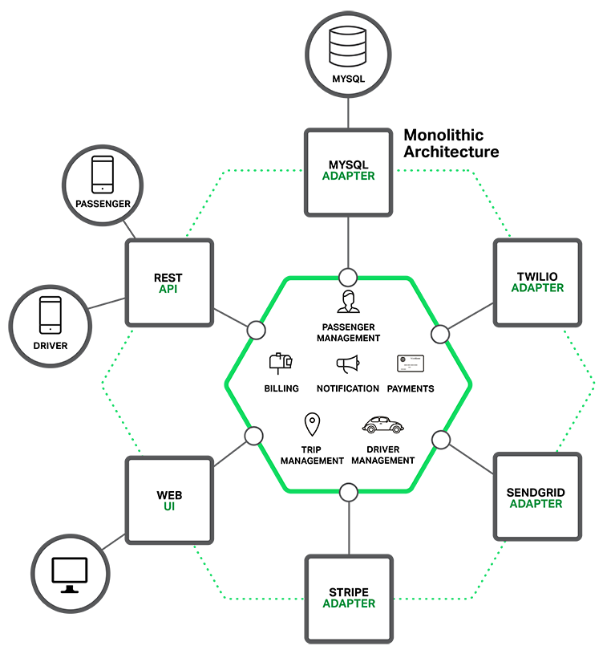
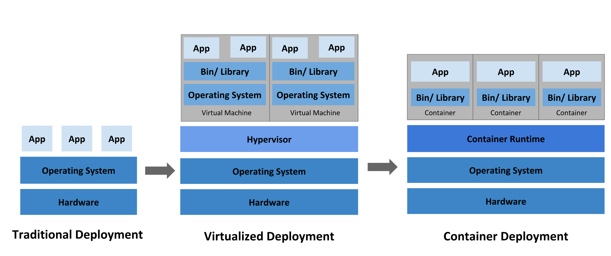
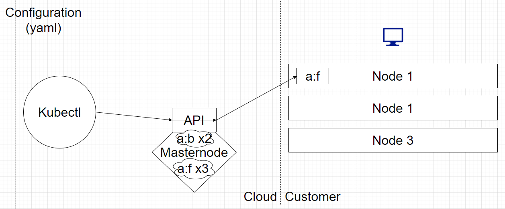

# What is Microservices Architecture?

In a short sentence, Microservices is an architecture, an approach in which a single application is composed of many loosely coupled and independently deployable smaller services.

Before we get to know more about Microservices, we need to understand how the term Microservice come out and what problem this architecture is designed to solve.

The term "micro web services" was first used by Dr. Peter Rogers during a conference on cloud computing in 2005. "Microservices" themselves premiered at an event for software architects in 2011, where the term was used to describe a style of architecture that many attendees were experimenting with at the time. In 2014, Martin Fowler talked about Microservices and the term begins to get a lot of attention.

## What is Monolith Architecture?

To understand Microservices architecture, we need to first understand how software are developed before the concept of Microservices showed up, and that is Monolithic Architecture.

Monolithic architecture is an architecture that the application is packaged and deployed as a single monolith. For example, a Java application that are packaged as WAR files and deployed on application servers such as Tomcat and Jetty.

Developing in Monolithic architecture is easy as this is how our IDEs and other tool are focus on, building a single application. Application built using monolithic architecture are easy to build, easy to deploy, easy to test and easy to scale, you can just run multiple copies of the application behind a load balancer.

However, everything changed after the application grows and become a huge monster that have millions of codes. Eventually, developers of successful application will continually be adding new features onto the application and it is a matter of time before the application become huge enough to eat all developers.

Once the application has become a huge and complex monolith, it will be too large for a single developer to fully understand every line of the code and bug fixing and implementation of new features will be difficult and time consuming.

Besides, a large application will also slow down the process of development. The larger the application is, the more time it takes to start and build the application. According to what NGINX stated in their blog, some developers reported start-up times as long as 12 minutes and in some cases, it might even take up to 40minutes to start up. It will be a huge waste of time if developers need to regularly restart the application server.

Another problem with a large monolithic application is that it makes continuous deployment very hard to achieve. To deploy a small change in a part of the application requires the whole application to redeploy as it is deployed as a whole. This will greatly impact the efficiency of software development as the deployment time for a huge application will also be long.

Monolithic application is also difficult to scale when different modules have conflicting resources requirements. For examples, one component requires intensive use of CPU while another module requires a better RAM to perform better. When the environment is unable to provide pump up CPU and RAM resources (For example different instances provide by Amazon EC2), performance of one module won’t be able to increase.

Finally, monolithic application makes it difficult for developers to shift to a new language or framework even if it is a better choice. Just think that you have a huge and complex application with millions of codes, it would be a nightmare if someone were to rewrite the entire application using another language or framework.  

To solve theses problems, the concept of Microservices Architecture is adopted by various organization worldwide including Alibaba, Amazon, eBay, Netflix and more. The idea of Microservices is simple, instead of building a single huge and complex monolithic application, we split the application into smaller services that are **loosely coupled** and independently deployable. These services communication with each other through combination of RESTapi.

Monolithic Architecture Example:

Microservices Architecture Example:

These services are loosely coupled and independently deployable. The boundary of the services is usually defined by the business capability of the organization to let the services independent from each other. Each service usually has their own databases to further decouple them.

## Benefits of Microservices Architecture

The Microservices Architecture can reduce the complexity of the application by decompose the huge monolithic application. If the boundary of the services is defined properly, the services in Microservices Architecture can maintain their part of business capability of the original huge monolithic application while greatly reducing the complexity of the code.

In microservices architecture, each service is maintained independently by a team that focus on the services. The small size of the services let start up and build time of the application become fast and saves time. Also, because the services are decoupled from each other, when a new feature is decided to add into the application, it can choose to use a new language or framework that have better performance. Furthermore, if the team decide to use a new language or framework for the service they had already written, they can simply rewrite the service because the service is small.

The Microservices Architecture also allows each service to be deployed independently. Developers can observe the impact of the changes rapidly and thanks to the small size, the deploy speed is also fast. This makes continuous deployment possible.

Last, Microservices Architecture enables each service to be scaled independently. Multiple copies of a service can be deployed to increase the performance of a specific part in the application. Also, services can be deployed to different environment and the conflict in resources requires by different services will no longer exist.

## Drawback of Microservices Architecture

Even if Microservices Architecture have so much advantage, it is not perfect. The most significant drawbacks of Microservices Architecture are the complexity it brings to the application itself. Although the complexity on each part of the application that are decomposed into services are decreased, but the overall complexity of the application is increased. Developers will need to handle the inter-process communication mechanism, deployment, monitoring, update and error handling of the services, which are easy to handle on a Monolithic Architecture.

Another major drawback of Microservices Architecture is that it requires a clear, distinct and well-defined product to decompose the application into different services. A blur boundary of services may result in dependencies between services and it makes the program has the slow speed and code complexity in a Monolithic Architecture and the difficulty and complexity in the whole application of Microservice Architecture.

To choose to implement Microservices Architecture on the application, we must not forget what the problem that Microservices Architecture are designed to solve, to increase the speed and good scalability possible on the huge application. Although it does bring drawbacks for example increased cost, difficulty and complexity, as long is the problem it aims to solve is solved, it should work fine.

# Why Microservices Are Viable? – Docker

Although Microservices Architecture can solve the problems of a Monolithic Architecture, Microservices Architecture are only adopt by big names in the market for example Netflix, which had successfully moved to the cloud, breaking up their monolith into hundred of fine-grained microservices by December 2011.

It was only until 2014 that the Microservice Architecture are getting popularity and software developer start to consider Microservice Architecture to be viable. The reason behind this is suspected to be the popularity of docker. To be simple, docker is a solution to build and share container, but what is a container?

Back in the days, organization runs their applications on physical servers. This solution has no way too define resources boundaries for applications in the physical server and cause resource allocation issues. The solution to this problem is to run each application on a different physical server but the resources will be highly underutilized and very expensive for any organization to maintain so many physical servers.

Virtualization was introduced after this. It allows one physical server to run multiple Virtual Machine with defined resources boundaries. The Virtual Machine are separated from each other which provide a level of security. This allows the physical server to better utilize it s resources. The capability of running multiple virtual machine on one physical server also greatly reduces the cost of deploying application. Every Virtual machine is a full machine running all the components including operating system.

Container is something like a virtual machine, but containers have relaxed isolation properties to share the operating system among different containers. This greatly reduce the weight of container and let container portable across clouds and operating system distributions.

Container are popular because they provide multiple benefits to developers. One of the major benefits is the performance of container. A container can be boot in seconds compared to a virtual machine which boots in minutes. Another major benefit is the environment consistency across development, testing, and production. A container consists of library and dependencies and combined with its lightweight, a container will be built during development, testing and deployment while maintaining the same environment. Container also greatly improves the resources utilization of a physical server as more application can be deployed onto a physical server using container deployment compared with virtualized deployment.

The benefits discussed above makes container deployment have much less cost and hassle compared with virtualized deployment. The concept of Microservices, combined with the concept of container, shows software developer a way to deploy to deploy applications in a much convenient way.

## How docker?

As discussed above, docker is a way to build and share container. In short words, docker can create a docker image, which is an image of a container. The image can be run on different machine and environment to create a container, which are identical to the container that the image is created from. This help software developers a lot as we now have hundreds or thousands of services need to be developed, test and deploy, and they all have different dependencies.

# Container is only container – Kubernetes

Container is only container, what it can do is act as an environment to run your applications. In a production environment, developers need to manage the containers that runs the application and ensure they run as expected, and that is where Kubernetes come it place, it is a framework to automate application deployment, scaling and management, also known as container-orchestration system.

## What can Kubernetes do?

Service discovery and load balancing.

- Kubernetes can expose a container using their name or ip address and also able to direct traffic, so the deployment works best.

Storage orchestration.

- Kubernetes can mount a storage system according to developer’s choice for example local storage and public cloud providers.

Automated rollouts and rollbacks.

- Kubernetes can create a desired state for containers according to user’s choice. For example, Kubernetes can remove existing containers and adopt all their resources to a new container.

Automatic bin packing.

- User provide Kubernetes with a cluster of nodes (hardware that have computing power) and how much CPU and RAM each container needs, Kubernetes will fit containers onto the nodes to make the best use of the resources.

Self-Healing

- Kubernetes restarts containers that fail, replace containers, kills containers that don’t respond to health check and don’t advertise them to clients until they are ready to server.

Secret and configuration management.

- Kubernetes allow user to deploy and update secrets and application configuration without rebuilding the container images, and without exposing secrets in the stack configuration.

## How?

Let’s first look at the components of Kubernetes. Node is a hardware that we can deploy our application on, like a server. Masternode is where Kubernetes manage the pods and nodes. Kubectl is how Kubernetes tell masternode user’s configuration.

Now, I want to create a pod, with my front end component inside, and with label a:f (application : front-end), so I write what I want inside a yaml file (call manifest in Kubernetes) and push it through kubectl. It will hit the api running on masternode, and masternode will talk to kubelet (A component responsible to scheduling and make sure apps are healthy and running within the node, exist in every node.) in one of the node, and the pod a:f will be created, as show on diagram above.

So now I want to deploy 3 of my front end components and 2 of my back end components and keep them running. After I complete the yaml file and it hits the master node, the master node will keep record of the deployment and make sure it works well. From the diagram above, the master node notice that only one front end component is deployed, so 2 more front end component and 2 more back end component are deployed.

Above is the basic flow of how Kubernetes deploy and manage the services. Kubernetes can also expose the ip of the services to let end users access the services by writing the yaml file.

# What is service mesh?

We talked about microservices architecture, and how the services are deployed and being orchestrate by Kubernetes, now we investigate how the services communicate with each other.

Services talks to each other and act together as a system to complete their job. In the communication of the system, a developer will want the connection between services to be **secure**, for example using TLS. They also want to dynamically configure how the service is **connect**ed to each another, for example they implement a new version of UI and want to direct 10% of the traffic to the new version of UI. Off course, developers will also want to **observe** and monitor the traffic flow in the system to find out the status of services and the bottleneck of the system. Also, they might want to **control** the communication between services by not allowing certain services talk to another services.

We know that Microservice Architecture consist of many services. The things stated above need to apply to every service. Due to the large numbers of service in the system, there might be times where developers forgot or make a mistake somewhere, and they will require a hard time to find out where did it went wrong. These problems come with a needs of a centralized network management, and that’s what service mesh is aimed to solve.

## Istio

Istio, is the solution for service mesh, it makes developers easy to create a network of deployed service with few or no code changes in the service code. Istio done this by inject a special sidecar proxy throughout the system that intercepts all network communications between microservice. It is like having a gateway for every service, with central control.

For conclusion, Istio helps solve the problems on connection between services. But this does not mean Istio solves all the problem. What Istio does is it provide a window for developers to view the complexity which are originally separated in the system. It does not lower the complexity. Moreover, developers even need to maintain Istio itself, normally deploy on Kubernetes, which is both very complex system. If a developer team does not have an experience person which have deep understanding of both Istio and Kubernetes, the cost of implementing Istio might come greater than its benefits.

# Conclusion

There is no silver bullet, with every technology we decide to implement on our application, we must always remember the problem that they are designate to solve. When the cost of implement that technology is larger than the benefits it can provide, or the technology cannot solve the problem in our specific environment, we must give up them and not follow the trend. Microservice + k8s + Istio real hard tho.
